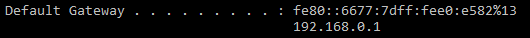

# Sunshine-Server-Manager-v1.0
The Sunshine Server Manager is a simple and easy to use way for people to host their own Minecraft server.  

First time Set up :

- Step 1 :
  Forward your ports.
  
  How do you do this? 
  
  First you must open your command line by going to the search bar in the bottom left (windows 10) or by 
  pressing the windows button and typing "cmd".
  
  Once you have the command line open, type in "ipconfig" and press enter.
  
  Next find the Ip address underneath 'Default Gateway'
  
  
  
  Copy and paste this address into the browser and press enter.
  
  Next you will want to login to your router.  The default in most cases is 
  (Username) : admin
  (Password) : [what ever your internet password is]
  
  Once you have done this, find the Port Forwarding tab in your router.
  
  Finally add what ever port you will be using for your minecraft server to the port forwarding list under UDP/TCP. 
  
  Minecraft servers most commonly use the port 25565, or 25575.
  
- Step 2 :
  Go to https://getbukkit.org/download/spigot and download the spigot version 1.14.4
  
  Finnaly put the spigot file you just downloaded in the resources folder you download from this github.
  
- Ready to go! 
  goodluck and have fun on your new Minecraft server!
  
  
  
  How to use :
  
  - Turning on the server
  
    -Simply press the red "offline" button in the bottom left and wait for it to go from "launching" to "Online".
    
    ![]
    
    - Once the CPU and RAM meters start working (changing numbers rapidly), you may not attempt to connect to the server using your       public Ip adress.  You may find this by going to https://whatismyipaddress.com
    
    
